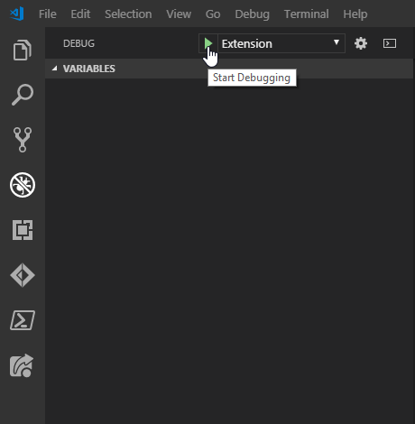
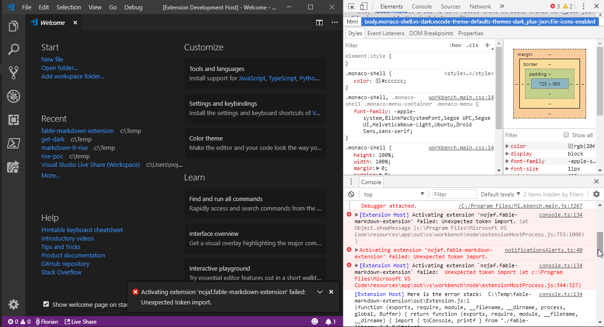
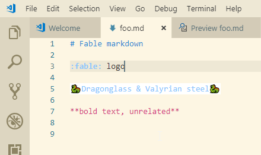
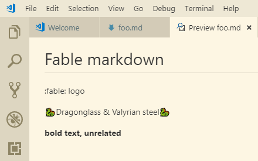

## Introduction

This post is part of the **[F# Advent Calendar in English 2018](https://sergeytihon.com/2018/10/22/f-advent-calendar-in-english-2018/)**. I'm very grateful to be a part of this and I hope you will enjoy this one as much as I have enjoyed the others.

Today I would like to show you how you can create [VS Code extension](https://code.visualstudio.com/docs/extensions/overview) from scratch using **Fable**. Along the way we write some code that will extend the [Markdown](https://www.markdownguide.org/getting-started) syntax.

## Project setup

### Code extension

To get started we will follow the general approach of scaffolding a new extension. Using the [yeoman](https://code.visualstudio.com/docs/extensions/yocode) generator we will scaffold a new _JavaScript_ extension.

### Adding Fable

In order to add Fable we need two main pieces: a couple of npm modules and some NuGet packages.  
First, we will add them with yarn.

> PS> cd fable-markdown-extension
> 
> PS> yarn add -D "fable-compiler" "fable-splitter"

We won't be using webpack as we don't really need a bundle in this scenario. When a plugin is installed all JavaScript is executed in a node environment. All files are on disk so there is no need to bundle in order to spare some network requests.

*   fable-compiler? The piece of Fable that compiles your F# source code. Don't be confused by the fact that this is a npm package. It contains a `.NET` executable and a compiled version of `Fable.Core`. Although it is not really that important to know all this.
*   fable-splitter? This npm package can compile multiple F# files linked by a `.fsproj` when configured correctly. We will use the splitter to compile F# files to JavaScript and nothing more. Under the hood `fable-splitter` uses `fable-compiler`.

Next we need a F# project. This can be a simple `netstandard classlib`.

> PS> dotnet new classlib -lang F# -o src -n AdventExtension

This created a `src` folder with a `Library.fs` file in it. Let us try and compile this to JavaScript using `fable-splitter`.  
In our `package.json` we can add a new script called `build`.

      "scripts": {
        "postinstall": "node ./node_modules/vscode/bin/install",
        "build": "fable-splitter --config splitter.config.js"
    }

And as you would expect we will also need a `splitter.config.js` file.  
The configuration looks like this:

    const path = require("path");

    function resolve(relativePath) {  
      return path.join(__dirname, relativePath);
    }

    module.exports = {  
      entry: resolve("src/AdventExtension.fsproj"),
      outDir: resolve("out"),
      allFiles: true
    };

Execute by running `yarn build`. This is the equivalent of running `npm run build`. Yarn just doesn't need the `run` word.  
We see that all the files in the project are compiled to the `out` folder as specified in `splitter.config.js`.

Now let us rename `Library.fs` and change it to `Extension.fs`, compile again and try to run our extension.

The `main` property of our `package.json` is pointing to `./extension`, so we will need to change that into `out/Extension.js`.  
However if we look at the existing `extension.js` file it seems to expose an `activate` function.

    // The module 'vscode' contains the VS Code extensibility API
    // Import the module and reference it with the alias vscode in your code below
    const vscode = require('vscode');

    // this method is called when your extension is activated
    // your extension is activated the very first time the command is executed
    function activate(context) {

        // Use the console to output diagnostic information (console.log) and errors (console.error)
        // This line of code will only be executed once when your extension is activated
        console.log('Congratulations, your extension "fable-markdown-extension" is now active!');

        // The command has been defined in the package.json file
        // Now provide the implementation of the command with  registerCommand
        // The commandId parameter must match the command field in package.json
        let disposable = vscode.commands.registerCommand('extension.sayHello', function () {
            // The code you place here will be executed every time your command is executed

            // Display a message box to the user
            vscode.window.showInformationMessage('Hello World!');
        });

        context.subscriptions.push(disposable);
    }
    exports.activate = activate;

    // this method is called when your extension is deactivated
    function deactivate() {  
    }
    exports.deactivate = deactivate;  

So we will need this in our Fable code as well.  
Changing `Extension.fs` to

    module AdventExtension.Extension

    let activate _ =  
        printfn "Fable extension is activated!"

should do the trick.

At this point we have had to compile for a couple times already. It would be easier if we could compile continuously.  
This can be achieved by means of another `fable-splitter`, so let's add a new build script `watch`:

        "scripts": {
            "postinstall": "node ./node_modules/vscode/bin/install",
            "build": "fable-splitter --config splitter.config.js",
            "watch": "yarn run build --watch"
        },

> yarn watch

Our compiled code looks like

    import { toConsole, printf } from "./fable-library.2.1.8/String";  
    export function activate(_arg1) {  
      toConsole(printf("Fable extension is activated!"));
    }

and we can launch the extension in code by hitting the play button in the Debug panel.  
However in our current setup we want our extension to run when VS Code starts.

Change the `activationEvents` to `*` in the `package.json`.

      "activationEvents": [
        "*"
      ]

and start debugging.

This opens a new instance of `vscode` and should contain our extension.

Yikes, this isn't really doing anything at all!  
We even see a crash when we toggle the developer tools.

What code is telling us here is that it doesn't know how to deal with the `import` and `export` keywords.  
I believe this whole thing is running in a node context, so we should be using `module.exports` instead.

One small Babel plugin can do this for us. We need to download it with `yarn` and tell `fable-splitter` to use it as well.

> PS> yarn add -D "@babel/plugin-transform-modules-commonjs" "@babel/core"

`splitter.config.js` becomes

    const path = require("path");

    function resolve(relativePath) {  
      return path.join(__dirname, relativePath);
    }

    module.exports = {  
      entry: resolve("src/AdventExtension.fsproj"),
      outDir: resolve("out"),
      babel: {
        plugins: ["@babel/plugin-transform-modules-commonjs"]
      },
      allFiles: true
    };

The JavaScript output now looks like

    "use strict";

    Object.defineProperty(exports, "__esModule", {  
      value: true
    });
    exports.activate = activate;

    var _String = require("./fable-library.2.1.8/String");

    function activate(_arg1) {  
      (0, _String.toConsole)((0, _String.printf)("Fable extension is activated!"));
    }

and our extension now runs!

### F# dependencies

Ok, after some trial and error we have the basics in place. However, a little intelliSense would not hurt.  
There is a NuGet package for that: [Fable.Import.VSCode](https://www.nuget.org/packages/Fable.Import.VSCode/).

We could install it into our `fsproj` with `dotnet add`, but I would prefer to download it with `paket` instead.  
Paket can easily be added to a project using:

> PS> dotnet tool install --tool-path ".paket" Paket --add-source [https://api.nuget.org/v3/index.json](https://api.nuget.org/v3/index.json)

This downloads the `.NETCore` version of Paket into a `.paket` folder. This should be familiar to most of us.  
Next we enter `.paket\paket.exe init`.

Open the `paket.dependencies` file and add

    source https://www.nuget.org/api/v2  
    storage:none  
    framework: netstandard2.0

    # nuget Fable.Import.Jest // Use when ready for Fable2
    github nojaf/fable-jest:fable2 fable/Bindings.fs  
    github nojaf/fable-jest:fable2 fable/Exports.fs  
    github nojaf/fable-jest:fable2 fable/Matchers.fs  
    nuget FSharp.Core redirects:force  
    nuget Fable.Import.VSCode  
    nuget Fable.Parsimmon  

It will download `VS Code` bindings, `Jest` bindings and `Fable.Parsimmon`. I'll explain later why we need those.  
Then, create a `paket.references` file next to the fsproj.

Add

    Fable.Import.VSCode  
    Fable.Parsimmon  
    File:Bindings.fs Jest  
    File:Exports.fs Jest  
    File:Matchers.fs Jest  

Run `.paket\paket.exe install`, which should add everything on **.NET** side.

### Those last npm packages

To wrap up the setup of the project, we still need a few npm packages.

> yarn add -D "jest" "markdown-it"

That should be it. Thanks for sticking around if you are still here 😊.  
Now we can finally start coding.

## Revelations

I feel like we have been through a lot already, and I haven't really revealed the master plan of all this.  
I mentioned that we would extend Markdown. In this blogpost we will add two new features:

*   Fable logo
*   Fable font

### Fable logo

Whenever we type `:fable:` in our Markdown file, we would like to [the Fable logo](https://fable.io/img/fable_logo.png) to show in our preview.

### Fable text

If we add text between two `🐉` emoji, it should rendered in a different font.

Both features should also be **highlighted** in the editor itself.

## Test-driven development

Now that we know what we want, we can start thinking about solving the problem.  
Without considering VS Code we know that we will need a way to detect`:fable:` and text between `🐉`.

What better way of parsing text than using [Fable.Parsimmon](https://github.com/Zaid-Ajaj/Fable.Parsimmon)?  
If you have any experience with [FParsec](http://www.quanttec.com/fparsec/), the API is very similar.

In order to have a **short feedback loop**, we can easily do some **TDD** instead of trying things out in the extension itself.

We already installed [Jest](https://jestjs.io/) and the accompanying F# bindings. Note that these bindings were installed with paket through `github` instead of `nuget`. This has to do with the fact that [Fable.Jest doesn't work 100% with Fable 2.X](https://github.com/jgrund/fable-jest/issues/13).

My fork of [Fable.Jest](https://github.com/jgrund/fable-jest/pull/14) contains a workaround for this.  
Here you can already see that using `paket` instead of `NuGet` was a smart move.

**Unit testing in Fable** is described to some extent in the [FAQ](https://fable.io/faq/#unit-tests). In our case everything is almost fully set up. We need to change the `test` script in our package.json.

    "scripts": {
        "postinstall": "node ./node_modules/vscode/bin/install",
        "build": "fable-splitter --config splitter.config.js",
        "watch": "yarn run build --watch",
        "test": "jest"
    },

Add a file that matches the following convention `*.test.fs` to our project, and the `*.test.js` should be picked up by **Jest**.  
`Parser.test.fs` with a _simple unit test_ should be enough for now.

    module AdventExtension.Tests.Parser

    open Fable.Import.Jest  
    open Fable.Import.Jest.Matchers

    test "simple Jest test should be picked up" <| fun () ->  
        "42" == "the answer of the Universe"

Execute with

> PS> yarn build
> 
> PS> yarn test

[Coolio](https://www.youtube.com/watch?v=VzDN7mCDoC0), we can unit test now! The way I like to proceed now is having two console windows. One to run `fable-splitter` with `yarn watch`, and other to run tests with `yarn test --watchAll`.

## Fable.Parsimmon

Since we are going to parse text, we need a type to capture the result of our parsing.

    type ParserResult =  
        | Text of string
        | FableFontText of NodeResult<string>
        | FableLogo of NodeResult<string>

We may now have found some text, text between dragons (🐉) or `:fable:`.  
When we have found one or both of the latter two, we would need to know where in our text we have found them.  
This is where `Parsimmon.node` comes in handy, as it returns a `NodeResult<'t>`.

    type TokenPosition =  
        { offset: int
          line: int
          column: int }

    type NodeResult<'t> =  
        { name: string
          value: 't
          start: TokenPosition
          ``end``: TokenPosition }

Next we need a function that takes a string and returns `Fable.Parsimmon.ParseResult<ParserResult array>`.

    let parseText input : ParseResult<ParserResult array> = failwith "Nothing here yet."  

And we can quickly write some tests.

    test "basic fable font" <| fun () ->  
        let input = "🐉vibes🐉"
        let parsed = Parser.parseText input
        parsed.status == true

    test "no fable font" <| fun () ->  
        let input = "fableless vibes"
        let parsed = Parser.parseText input
        parsed.status == true

    test "fable logo is found" <| fun () ->  
        let input = "Once upon a :fable:..."
        let parsed = Parser.parseText input

        parsed.status == true

        match parsed.value with
        | [| Text _; FableLogo logo; Text _|] ->
            logo.start.offset == 12
            logo.value.Length == 7
        | _ -> failwith "Expected logo in center"

Notice that `==` is a shorthand for `Fable.Import.Jest.Exports.expect.Invoke("foo").toBe("bar")`.

To make these tests pass we'll write some custom parsers, mostly based on regular expressions.

    module AdventExtension.Parser

    open Fable.Parsimmon  
    open Fable.Core  
    open System.Text.RegularExpressions

    type ParserResult =  
        | Text of string
        | FableFontText of NodeResult<string>
        | FableLogo of NodeResult<string>

    // no /g flag
    [<Emit("new RegExp($0)")>]
    let createRegex pattern : Regex = jsNative

    let dragonParser = Parsimmon.str "🐉"

    let noDragonParser =  
        Parsimmon.regex (createRegex @"[^🐉]+")

    let fableFontParser =  
        Parsimmon.between dragonParser dragonParser noDragonParser
        |> Parsimmon.node "FableFont"
        |> Parsimmon.map (ParserResult.FableFontText)

    let halfDragon =  
        "🐉".ToCharArray()
        |> Array.head
        |> (string)

    let noDragonsParser =  
        Parsimmon.satisfy (fun token -> token <> halfDragon && token <> ":")
            |> Parsimmon.atLeastOneOrMany
            |> Parsimmon.concat
            |> Parsimmon.map (ParserResult.Text)

    let fableLogoParser =  
        Parsimmon.str ":fable:"
        |> Parsimmon.node "FableLogo"
        |> Parsimmon.map (FableLogo)

    let parseText input : ParseResult<ParserResult array> =  
        Parsimmon.choose [ 
            fableLogoParser
            noDragonsParser
            fableFontParser
        ] 
        |> fun parser -> parser.many().parse(input)

I won't go into detail about exactly how this works but I do want to highlight two things:

*   `"🐉".Length` returns `2`. And `Parsimmon.satisfy` only compares a single token at a time.
*   Creating a `Regex` via the .NET API compiles to a JavaScript Regex that uses the `/g` flag. This is something we don't want in this case, so I've added a little helper that emits a `Regex`.

Presumably this code is more or less readable, and we can continue 😅.

## Highlighting code

Highlighting in VS Code is surprisingly easily. All we need to do is tell code which `range` should be decorated with which `style`.

Let's first create some `TextDecorationEditorStyle` objects.

    module AdventExtension.Extension

    open Fable.Core.JsInterop  
    open Fable.Import.vscode

    let createFontOptions color backgroundColor fontWeight : DecorationRenderOptions =  
        jsOptions (fun options ->
            options.color <- Some color
            options?fontWeight <- fontWeight
            options.backgroundColor <- backgroundColor
        )

    let activate _ =  
        let fableFontStyle = window.createTextEditorDecorationType(createFontOptions "#87c5fd" (Some "white") None)
        let fableLogoStyle = window.createTextEditorDecorationType(createFontOptions "#87c5fd" None (Some "bold"))

        printfn "Fable extension activated!"

Now we need to subscribe to certain events.

    let activate (context: ExtensionContext) =  
        let fableFontStyle = window.createTextEditorDecorationType(createFontOptions "#87c5fd" (Some "white") None)
        let fableLogoStyle = window.createTextEditorDecorationType(createFontOptions "#87c5fd" None (Some "bold"))

        // Capture the active editor.
        let mutable activeEditor = window.activeTextEditor

        let updateDecorations() = failwithf "Nothing here yet."

        let mutable timeoutKey = None;
        let triggerUpdateDecorations _ =
            timeoutKey
            |> Option.iter (JS.clearTimeout)

            timeoutKey <- Some (JS.setTimeout updateDecorations 500)

        // User is typing
        window.onDidChangeActiveTextEditor.Invoke((fun editor ->
            activeEditor <- Some editor
            triggerUpdateDecorations()
            null
        ))
        |> context.subscriptions.Add

        // Change of document
        workspace.onDidChangeTextDocument.Invoke((fun event ->
            match activeEditor with
            | Some aEditor when (event.document = aEditor.document) ->
                triggerUpdateDecorations()
            | _ -> ()
            null
        ))
        |> context.subscriptions.Add

        activeEditor
        |> Option.iter (triggerUpdateDecorations)

        printfn "Fable extension activated!"

Notice that the event handlers call `triggerUpdateDecorations`, which prevents us from re-rendering too much.

    // Parsimmon ranges are 1-based, VS Code works with 0-based indexing.
    let nodeResultToRange<'t> (nr: NodeResult<'t>) =  
        let zeroBasedFloat r = r - 1 |> (float)
        vscode.Range(zeroBasedFloat nr.start.line,
                     zeroBasedFloat nr.start.column,
                     zeroBasedFloat nr.``end``.line,
                     zeroBasedFloat nr.``end``.column)

    let updateDecorations() =  
        activeEditor
        |> Option.iter (fun aEditor ->
            if aEditor.document.languageId = "markdown" then
                let text = aEditor.document.getText()
                let parsed = Parser.parseText text

                if parsed.status then
                    parsed.value
                    |> Array.map (fun node ->
                        match node with
                        | ParserResult.FableLogo logo ->
                            Some (fableLogoStyle, nodeResultToRange logo)

                        | ParserResult.FableFontText fableText ->
                            Some (fableFontStyle, nodeResultToRange fableText)

                        | _ ->
                            None

                    )
                    |> Array.choose id
                    |> Array.groupBy (fun (style,_) -> style.key)
                    |> Array.iter (fun (styleKey, ranges) ->
                        let r =
                            Array.map snd ranges
                            |> ResizeArray

                        let style = if fableFontStyle.key = styleKey then fableFontStyle else fableLogoStyle

                        aEditor.setDecorations(style, !^ r)
                    )
        )

`updateDecorations` is rather straightforward as well. We map the result of `parseText` and make ranges out of it. The result looks as follows:

## Preview mode

When we switch to preview mode of the Markdown file, we don't really see any changes.

This can be changed by writing our own [markdown-it](https://markdown-it.github.io/) extension.  
To be fair, it took me a while to figure out how this works. Even after reading the [documentation](https://github.com/markdown-it/markdown-it/blob/master/docs/architecture.md), I was still somewhat puzzled.

What `markdown-it` does is it parses the Markdown content to a token stream.

Ex.

    This is some **markdown text**  

Will be parsed to

    [
      {
        "type": "paragraph_open",
        "tag": "p",
      },
      {
        "type": "inline",
        "tag": "",
        "map": [
          0,
          1
        ],
        "nesting": 0,
        "level": 1,
        "children": [
          {
            "type": "text",
            "tag": "",
            "content": "This is some ",
          },
          {
            "type": "strong_open",
            "tag": "strong",
          },
          {
            "type": "text",
            "tag": "",
            "content": "markdown text",
          },
          {
            "type": "strong_close",
            "tag": "strong",
          },
          {
            "type": "text",
            "tag": "",
          }
        ],
        "content": "This is some **markdown text**",
      },
      {
        "type": "paragraph_close",
        "tag": "p",
      }
    ]

Note that this is a simplified version. We need to break down any tokens of `type:"text"` and replace them with our own token type (`fable-logo` and `fable-text`).

Once we've updated the tree, we can hook into the render engine by adding custom rules.

### F# bindings

I found that there are TypeScript bindings on [npm](https://www.npmjs.com/package/@types/markdown-it). With [ts2fable](https://github.com/fable-compiler/ts2fable) I cooked up some [minimal F# bindings](https://github.com/nojaf/fable-markdown-extension/blob/master/src/MarkdownIt.fs) which we can use.

### Unit tests

Since this is a rather tricky situation, we should add some tests first.

    module AdventExtension.Tests.MarkdownPlugin

    open Fable.Import.Jest  
    open AdventExtension.MarkdownPlugin

    jest.unmock("markdown-it")

    let md = MarkdownItModule.Exports.Invoke().``use``(fableMarkdownPlugin)

    test "fable img is rendered" <| fun () ->  
        let input = ":fable:"
        let parsed = md.render input
        expect.Invoke(parsed.StartsWith("
  
        let input = "Over the seas 🐉we shall rise🐉!"
        let parsed = md.render input
        expect.Invoke(parsed.Contains("we shall rise")).toBeTruthy()

The plugin function `fableMarkdownPlugin` looks like

    module AdventExtension.MarkdownPlugin

    open MarkdownItModule  
    let fableMarkdownPlugin (md: MarkdownIt) (options: Options) = failwith "Nothing yet"  

Inside this function, we need to replace the tokens and add custom render rules.

    module AdventExtension.MarkdownPlugin

    open MarkdownItModule  
    open Fable.Core  
    open AdventExtension.Parser

    [<Emit("new $0.Token($1,$2,$3)")>]
    let createToken state name tag nesting: Token = jsNative

    [<Emit("$0[$1] = $2")>]
    let addRenderRule rules name fn: unit = jsNative

    let fableMarkdownPlugin (md: MarkdownIt) (options: Options) =  
        // Phase one: replace text tokens to custom tokens
        let replaceTokens (state: State) =
            let parseTextToken (parentToken: Token) (textToken: Token) = 
                let textContent = textToken.content
                let parsedContent = parseText textContent
                let updatedChildren =
                    if not parsedContent.status then
                        Array.empty
                    else
                        parsedContent.value
                        |> Array.map (fun node ->
                            match node with
                            | ParserResult.Text text ->
                                let t = createToken state "text" "" 0
                                t.content <- text
                                t

                            | ParserResult.FableLogo _ ->
                                createToken state "fable-logo" "img" 0

                            | ParserResult.FableFontText fontText ->
                                let t = createToken state "fable-font" "span" 0
                                t.content <- fontText.value.Replace("🐉", "")
                                t
                        )

                parentToken.children <- new ResizeArray<Token>(updatedChildren)

            let rec parseToken (parentToken: Token) (token: Token) =
                if token.children <> null && not(Seq.isEmpty token.children) then
                    token.children
                    |> Seq.iter (fun childToken ->
                        if childToken.``type`` = "inline" then
                            parseToken token childToken
                        else
                            parseTextToken token childToken 
                    )

                if token.``type`` = "text" then
                    parseTextToken parentToken token

            state.tokens
            |> Seq.filter (fun t -> t.``type`` = "inline" && t.children <> null && not (Seq.isEmpty t.children))
            |> Seq.iter (fun token ->
                token.children
                |> Seq.iter (parseToken token)
            )

        md.core.ruler.push("fable", replaceTokens)

This code might not look like much, but we are traversing the tree, replacing the `children` of a parent node that contains `text`.

Our unit tests remain unaffected, as the render part will just ignore the `fable-logo` and `fable-text` tokens and render them as regular `text`.

Part two determines how our own nodes should render:

    [<Emit("$0[$1] = $2")>]
    let addRenderRule rules name fn: unit = jsNative

    let fableMarkdownPlugin (md: MarkdownIt) (options: Options) = ...  
        // Phase one ...

        // Phase two
        let renderFableLogo tokens idx = ""

        let renderFableText (tokens: Token array) (idx: int) =
            let token = tokens.[idx]
            sprintf "%s" (token.content.Replace("🐉", ""))

        addRenderRule md.renderer.rules "fable-logo" (new System.Func<Token array,int,string>(fun tokens idx -> renderFableLogo tokens idx))
        addRenderRule md.renderer.rules "fable-font" (new System.Func<Token array,int,string>(fun tokens idx -> renderFableText tokens idx))

We need to wrap our render functions inside a `System.Func<_,_,_>` in order to preserve compatibility with JavaScript.  
The reason for this is that Fable compiles these into functions that can be curried, and markdown-it doesn't like this.

Once more our tests show green, and the times has come to shove this into our VS Code extension.

### Tag on code

To see all this in code we need to extend the `contributes` section in our `package.json`

      "contributes": {
        "markdown.markdownItPlugins": true,
        "markdown.previewStyles": [
          "./fable.css"
        ]
      }

Create a `fable.css` file

    // this works in code, I was somewhat surprised by this. Should be a local url in real world scenario.
    @import url('https://fonts.googleapis.com/css?family=Josefin+Slab:400,600i'); 

    .fable {
        font-family: 'Josefin Slab', serif;
        font-weight: 600;
        font-style: italic;
        color: #87c5fd;
        font-size: 18px;
    }

    .fable-logo {
        display: inline-block;
        width: 24px;
    }

And make the final change to `Extension.fs` by adding

        // Add render plugin
        createObj [
            "extendMarkdownIt" ==> (fun md -> md?``use``(MarkdownPlugin.fableMarkdownPlugin))
        ]

at the end.

Final outcome:

## The Source

You can find all code on my [github](https://github.com/nojaf/fable-markdown-extension).

## Remarks

*   The extension has not been published in the store, nor do I have the intention to so.
*   This was my first **VS Code** and **markdown-it** plugin, so there is some room for improvement.
*   `fable-splitter` is very fast. I didn't miss `fable-loader` and `webpack` for a single moment.
*   Many thanks to [Zaid Ajaj](https://github.com/Zaid-Ajaj) for the help with Fable.Parsimmon.

## Final words

I hope you enjoyed this blogpost and it all makes sense to you. If you have any suggestions or questions, please leave a comment.

Yours truly,  
nojaf

Photo by <a style="background-color:black;color:white;text-decoration:none;padding:4px 6px;font-family:-apple-system, BlinkMacSystemFont, &quot;San Francisco&quot;, &quot;Helvetica Neue&quot;, Helvetica, Ubuntu, Roboto, Noto, &quot;Segoe UI&quot;, Arial, sans-serif;font-size:12px;font-weight:bold;line-height:1.2;display:inline-block;border-radius:3px" href="https://unsplash.com/@playjack01?utm_medium=referral&amp;utm_campaign=photographer-credit&amp;utm_content=creditBadge" target="_blank" rel="noopener noreferrer" title="Download free do whatever you want high-resolution photos from Massimo Rinaldi"><svg xmlns="http://www.w3.org/2000/svg" style="height:12px;width:auto;position:relative;vertical-align:middle;top:-2px;fill:white" viewBox="0 0 32 32"><title>unsplash-logo</title><path d="M10 9V0h12v9H10zm12 5h10v18H0V14h10v9h12v-9z"></path></svg>Massimo Rinaldi</a>